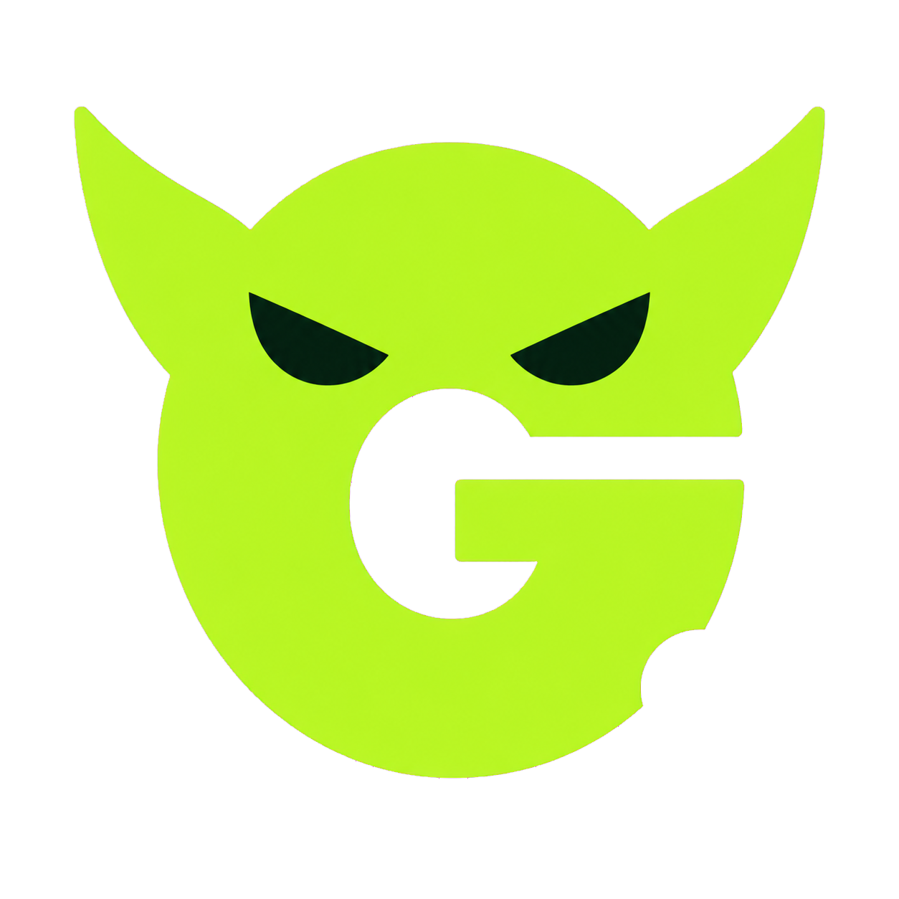

# Draft Goblin

  

  <strong>Your live fantasy football draft companion for ESPN and Sleeper.</strong>

Draft Goblin helps you make every pick with confidence. Open it beside your live NFL fantasy draft to compare the best available players, understand how each one fits your roster, and see who is likely to be gone before your next turn.

It is free, private, and read-only. Draft Goblin never makes a pick for you or changes anything in your league—you always stay in control.

## Why use Draft Goblin?

Player rankings are useful, but they do not know what has already happened in your draft. Draft Goblin follows the live board and adjusts its advice for:

- the players who are still available;
- your current roster and open starting spots;
- your league's scoring and lineup settings;
- where you pick next;
- whether a player is likely to make it back to you;
- each player's projection, floor, ceiling, and risk; and
- how different choices may affect your team's championship outlook.

Instead of giving you only a name, Draft Goblin explains the tradeoff behind every recommendation.

## Built to agree with consensus—and add more context

Draft Goblin's projections stay closely aligned with the broader projection consensus while adding the live draft context that a static consensus ranking cannot provide.

On the current matched comparison of **590 PPR players**:

| Consensus comparison | Draft Goblin result | What it means |
| --- | ---: | --- |
| **Rank correlation** | **0.9958 Spearman** | Player ordering is extremely close to consensus; `1.0` would be identical. |
| **Mean absolute difference** | **2.60 points** | A Draft Goblin season projection differs from consensus by only 2.60 fantasy points on average. |

That gives you a projection foundation that closely tracks consensus, plus Draft Goblin's roster fit, floor and ceiling, positional need, next-pick availability, and championship simulations for the decision in front of you.

These are agreement measurements against consensus, not accuracy measurements against future NFL results. Lower mean absolute difference and higher rank correlation indicate closer agreement. See [Projection sources and methodology](docs/PROJECTIONS.md) for the comparison details and validation limits.

## Features

### Live recommendations

Draft Goblin connects to your active ESPN or Sleeper draft and updates as picks are made. It shows eight leading options for your next selection, with one clearly labeled as the current lean.

For every option, you can see:

- projected fantasy points;
- floor and ceiling estimates;
- position and NFL team;
- how the player fits your roster;
- the chance the player is still available at your next pick;
- useful follow-up players for later rounds;
- estimated championship odds if you make that selection; and
- a plain-language explanation of what you gain and when the pick makes sense.

When two choices are too close to separate confidently, Draft Goblin labels the decision as a close call instead of pretending there is a clear winner.

### Complete player board

Want to look beyond the recommended eight? Open the **Player board** to browse every undrafted player.

You can:

- search by player name or NFL team;
- filter by QB, RB, WR, TE, K, or DST; and
- sort by Draft Goblin value, projection, floor, ceiling, draft-site value, ADP, or next-pick availability.

The complete board appears immediately while deeper simulations continue in the background.

### Choose your drafting style

You can use Draft Goblin's default strategy or choose a different decision lens:

- **Maximize title odds** — focuses on the strongest simulated championship outcome.
- **Balanced title odds** — balances championship upside with other draft factors.
- **Maximum upside** — favors higher ceilings.
- **Safe floor** — favors more dependable outcomes.
- **Best projection** — prioritizes projected fantasy points.
- **Custom weights** — lets you shape the recommendation yourself.

You can also choose whether rankings rely on Draft Goblin's projections or projections visible on the current draft site, adjust how much ADP matters, and limit recommendations to selected positions.

### 10,000 draft simulations

For the eight leading choices, Draft Goblin simulates the rest of the draft and the resulting fantasy season 10,000 times. It uses the same scenarios to compare each choice fairly and displays progress while it works.

Simulations have a 25-second limit so Draft Goblin stays responsive while you are on the clock. Championship percentages are estimates, not guarantees; use them as another piece of evidence alongside the explanations and your own judgment.

### End-of-draft report

After the league's final pick, Draft Goblin automatically creates a private report with:

- your overall draft grade;
- your modeled championship chance;
- your projected weekly-scoring rank;
- your championship-odds rank;
- your complete roster and pick history; and
- projected weekly scoring and title odds for every team in the league.

Your ten most recent reports are saved locally in Chrome.

## Supported drafts

Draft Goblin currently supports:

- NFL fantasy football;
- ESPN and Sleeper;
- snake redraft leagues; and
- standard, half-PPR, and PPR scoring.

Draft Goblin does **not** currently support:

- auction drafts;
- dynasty or keeper leagues;
- superflex leagues; or
- third-round reversal drafts.

If Draft Goblin cannot confirm that a draft is supported, it stays inactive rather than showing advice based on incorrect settings.

## Install Draft Goblin

Draft Goblin is currently installed directly from this repository.

1. Download or clone this repository to your computer.
2. Open `chrome://extensions` in Google Chrome.
3. Turn on **Developer mode** in the upper-right corner.
4. Select **Load unpacked**.
5. Choose the `extension` folder inside the downloaded Draft Goblin folder.
6. Pin Draft Goblin from Chrome's Extensions menu for easy access.

Draft Goblin requires Google Chrome 116 or newer.

## Use Draft Goblin

1. Open your ESPN or Sleeper snake draft.
2. Select **Open Draft Goblin** on the draft page. If the button is not visible, select the Draft Goblin icon in Chrome's toolbar.
3. Keep the Draft Goblin side panel open beside your draft room.
4. Wait for the connection checklist to confirm the draft, league settings, and your draft slot.
5. Review the current lean and seven alternatives whenever your pick approaches.
6. Use the **Player board** whenever you want to explore every available player.
7. After the draft ends, open your completed-draft report from the side panel.

No account or setup form is required. Draft Goblin reads the supported draft already open in your browser and connects automatically.

## Optional faster simulations

Draft Goblin can run entirely inside Chrome. For faster 10,000-simulation results, Windows users can also open **Start Draft Goblin.cmd** before the draft and leave its terminal window running.

This starts a private simulation helper on your own computer. If you close it—or never start it—Draft Goblin automatically continues with its built-in Chrome simulation engine.

## Your privacy

Draft Goblin is designed to keep your draft activity private:

- It never makes picks or changes your league.
- It does not collect analytics or browsing history.
- It does not sell data or use it for advertising.
- It does not send your draft or personal information to the developer.
- Preferences and completed reports stay in Chrome's local extension storage.
- It uses your existing ESPN session only to read the supported draft already open in Chrome; it does not collect your ESPN password.
- Public projection updates contain no account, draft, or personal information.

Read the complete [privacy policy](PRIVACY.md) and [security policy](SECURITY.md).

## Troubleshooting

### Draft Goblin is not connecting

- Make sure you are inside the active draft room, not a league page or draft lobby.
- Confirm that the league uses a supported format.
- Select the refresh button in the Draft Goblin header.
- Reload the ESPN or Sleeper draft tab.
- Open `chrome://extensions`, find Draft Goblin, and select **Reload**.
- Return to the draft room and select **Open Draft Goblin** again.

### My ESPN draft is open, but recommendations are waiting

ESPN's clock can occasionally move before its completed-pick history updates. Draft Goblin pauses briefly so it does not recommend a player who was just selected. Recommendations resume automatically when ESPN finishes syncing.

### My draft slot was not detected

Draft Goblin normally finds your slot automatically. If the draft platform does not provide enough information, follow the prompt in the side panel to enter the slot manually for that draft.

### Exact title odds did not finish

Select **Retry exact odds** in the side panel. You can also start **Start Draft Goblin.cmd** for faster local simulations. The full player board and projection-based comparisons remain available even when an exact simulation cannot finish within the time limit.

### The side panel feels too narrow

Drag Chrome's divider toward the draft page to give Draft Goblin more room. The side panel will adjust to the available width.

### The draft has ended, but the report is not ready

Draft Goblin waits until every team's final pick has synced. The report starts automatically as soon as the complete draft board is available.

## Frequently asked questions

### Does Draft Goblin make picks for me?

No. Draft Goblin is strictly read-only. It gives you information and recommendations, but you make every selection on ESPN or Sleeper.

### Do I need an account?

No. Install the extension, open a supported draft, and Draft Goblin connects automatically.

### Does it work without the optional simulation helper?

Yes. Everything can run locally inside Chrome. The optional helper only makes deeper simulations faster on supported computers.

### Where do the projections come from?

Draft Goblin includes its own packaged projection baseline and can use supported projection updates. You can also choose projections visible on the current draft site when they are available. For full details, see [Projection sources and methodology](docs/PROJECTIONS.md).

### Are the championship odds guaranteed?

No. They are model estimates based on projections, uncertainty, simulated draft completion, weekly scoring, and playoffs. Fantasy football is unpredictable, so the odds should support—not replace—your judgment.

### Where are my reports stored?

Completed reports are stored locally by the Draft Goblin Chrome extension. Up to ten recent reports are retained.

## Need help?

- Report a problem or request a feature through [GitHub Issues](https://github.com/coolstick784/draft-goblin/issues).
- For a security concern, follow the private reporting instructions in [SECURITY.md](SECURITY.md) instead of opening a public issue.
